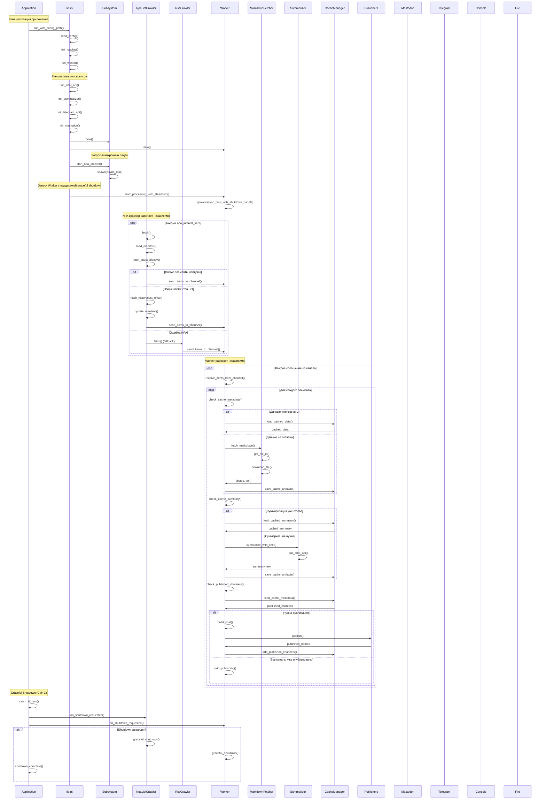

# Luminis - Архитектура приложения

## Диаграмма последовательности основного потока



## Компоненты системы


### Worker
- **Назначение**: Асинхронная обработка элементов краулинга с поэтапной проверкой кэша
- **Основные функции**:
  - Запускается в отдельной задаче с SubsystemHandle и работает независимо
  - Ожидает сообщения из канала от NPA краулера
  - Поддержка graceful shutdown через tokio::select!
  - Поэтапная проверка кэша: данные → суммаризация → статус публикации
  - Скачивание данных только при необходимости
  - Суммаризация текста через AI только при необходимости
  - Публикация только в неопубликованные каналы
  - Построение постов из шаблонов
  - Корректное сохранение состояния при завершении

### Crawlers
- **NpaListCrawler**: Читает данные с regulation.gov.ru
  - Всегда начинает с offset=0 (последние новости)
  - При отсутствии новых данных углубляется в историю
  - Сохраняет прогресс в manifest.json
  - При ошибках самостоятельно запускает RssCrawler как fallback
- **RssCrawler**: Fallback источник данных
  - Запускается NpaListCrawler при ошибках
  - Парсит RSS фид

### Publishers
- **Console**: Вывод в консоль
- **File**: Сохранение в файл
- **Telegram**: Публикация в Telegram
- **Mastodon**: Публикация в Mastodon

### CacheManager
- **Назначение**: Поэтапное кэширование артефактов для оптимизации
- **Структура**:
  - Метаданные проекта (проверка наличия данных)
  - Исходные документы (docx) - кэшируются после скачивания
  - Извлеченный markdown - кэшируется после парсинга
  - Суммаризированный текст - кэшируется после AI обработки
  - Финальные посты - кэшируются после построения
  - Статус публикации по каналам - отслеживает где уже опубликовано

## Поток данных

1. **Инициализация**: Загрузка конфигурации, инициализация сервисов
2. **Запуск асинхронных задач**: NPA краулер и Worker запускаются в отдельных задачах
3. **Независимая работа**: NPA краулер и Worker работают независимо друг от друга
4. **Периодический краулинг**: NPA краулер работает по расписанию и отправляет данные в канал
5. **Событийная обработка**: Worker ждет сообщения из канала и обрабатывает их
6. **Поэтапная обработка**: Worker проверяет кэш на каждом этапе:
   - Проверка наличия данных → скачивание при необходимости
   - Проверка наличия суммаризации → AI обработка при необходимости  
   - Проверка статуса публикации → публикация только в новые каналы
7. **Кэширование**: Все артефакты сохраняются поэтапно для оптимизации

## Graceful Shutdown

Приложение поддерживает корректное завершение работы через `tokio_graceful_shutdown`:

### Механизм работы:
- **Перехват сигналов**: `Toplevel::catch_signals()` перехватывает Ctrl+C
- **SubsystemHandle**: Каждый компонент получает handle для отслеживания shutdown
- **tokio::select!**: Компоненты используют select для ожидания shutdown или основной работы
- **Корректное завершение**: Сохранение состояния кэша и закрытие соединений

### Пример реализации:
```rust
async fn worker_subsystem(subsys: SubsystemHandle) -> Result<()> {
    tokio::select! {
        _ = subsys.on_shutdown_requested() => {
            tracing::info!("Worker shutdown requested");
            // Сохранение финального состояния
            save_final_state().await?;
        },
        _ = worker_main_loop() => {
            // Основная работа worker
        }
    };
    Ok(())
}
```

## Особенности архитектуры

- **Полная асинхронность**: NPA краулер и Worker работают в отдельных задачах независимо
- **Graceful Shutdown**: Поддержка корректного завершения по Ctrl+C через tokio_graceful_shutdown
- **Разделение ответственности**: Lib только запускает задачи, не участвует в их работе
- **Событийно-ориентированная обработка**: Worker ждет сообщения из канала, а не работает по таймеру
- **Отказоустойчивость**: NpaListCrawler самостоятельно запускает RssCrawler при ошибках
- **Простота**: Worker просто ждет данные из канала без таймаутов
- **Поэтапное кэширование**: Проверка кэша на каждом этапе (данные → суммаризация → публикация)
- **Оптимизация**: Избежание повторной обработки на любом этапе
- **Селективная публикация**: Публикация только в неопубликованные каналы
- **Модульность**: Четкое разделение ответственности
- **Конфигурируемость**: Все параметры настраиваются через config.yaml
